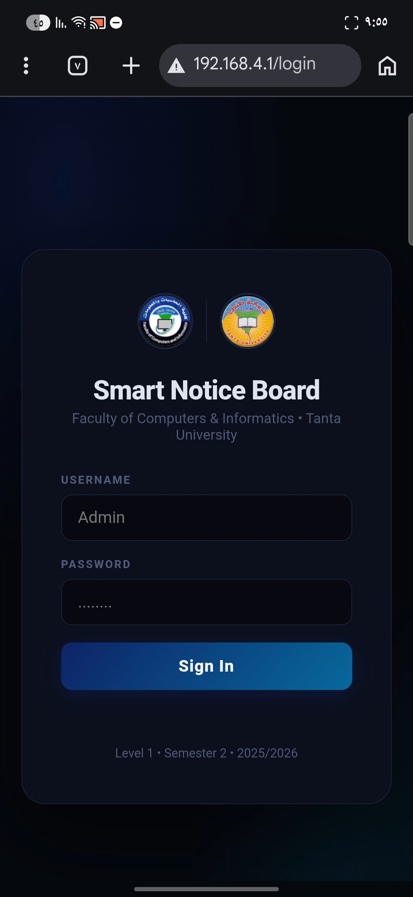
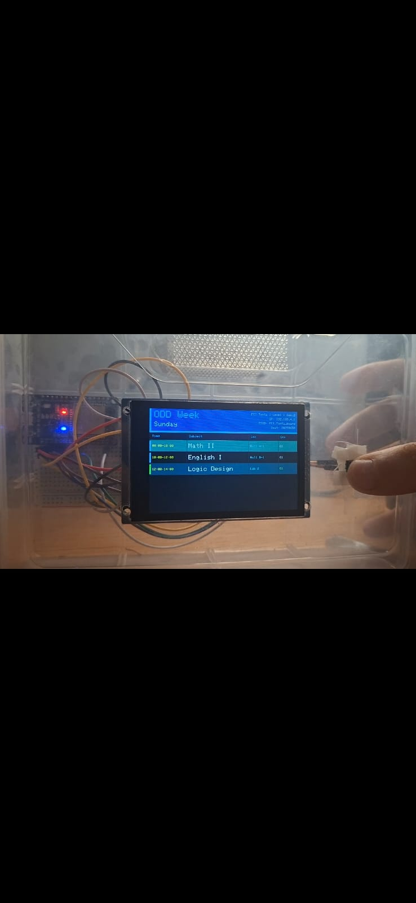
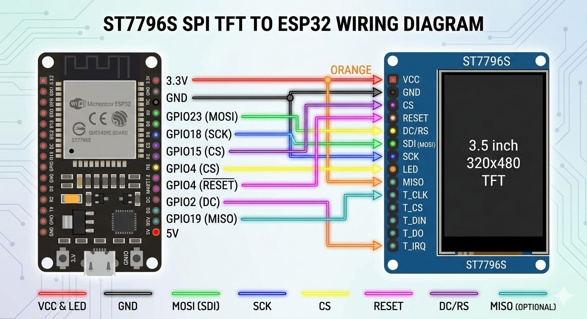

# 🚀 Smart Digital Notice Board (ESP32 + IoT Dashboard)

نظام لوحة إعلانات رقمية ذكية تفاعلية لعرض جداول المحاضرات والتنبيهات، يعتمد على متحكم **ESP32** وشاشة **TFT 3.5"**، مع واجهة تحكم كاملة عبر الويب (Dashboard).

---

## 📺 استعراض المشروع (Demo)
[)](رابط_فيديو_اليوتيوب_هنا)

---

## ✨ المميزات (Features)
- **عرض ديناميكي:** شاشة TFT مقاس 3.5 بوصة تعرض البيانات بجودة عالية باستخدام مكتبة `TFT_eSPI`.
- **Web Dashboard:** لوحة تحكم متجاوبة تتيح تعديل المواعيد والتنبيهات لحظياً عبر المتصفح.
- **أنظمة التحكم:** يدعم التنقل اليدوي (Manual)، التلقائي (Auto)، والتحكم عن بُعد (Remote).
- **تنسيق JSON:** تبادل البيانات بكفاءة عالية باستخدام `ArduinoJson`.

---

## 📸 لقطات من المشروع (Screenshots)

### 1. واجهة التحكم (Web Dashboard)

### 2. مخرج الهاردوير (Hardware Output)

---

## 🔌 مخطط التوصيل (Circuit Diagram)

يمكنك اتباع المخطط التالي لتوصيل الشاشة والمكونات بالمتحكم:

### جدول التوصيلات (Pin Mapping)
| المكون (Component) | دبوس الشاشة (Display Pin) | دبوس المتحكم (ESP32 Pin) |
| :--- | :--- | :--- |
| **TFT Display** | VCC | 3.3V |
| | GND | GND |
| | CS | D15 |
| | RST | D4 |
| | DC/RS | D2 |
| | SDI (MOSI) | D23 |
| | SCK | D18 |
| **Push Button** | Pin 1 | D5 |
| | Pin 2 | GND |

---

## 🛠️ المكونات (Hardware Requirements)
- **Microcontroller:** ESP32 (NodeMCU).
- **Display:** 3.5 inch TFT LCD (ILI9488).
- **Libraries:** `TFT_eSPI`, `ESPAsyncWebServer`, `ArduinoJson`.

---

## ⚙️ طريقة التشغيل (Setup)
1. قم بضبط إعدادات مكتبة `TFT_eSPI` في ملف `User_Setup.h`.
2. أدخل بيانات الواي فاي (`SSID`, `Password`) في الكود.
3. ارفع الكود على الـ ESP32 وارفع ملفات الويب باستخدام LittleFS.
4. ادخل على عنوان الـ IP الظاهر في الـ Serial Monitor.

---## 👤 المطور (Developer)
**Mohamed Halim**
Computer Science Student - First Year 🎓
*Passionate about Embedded Systems & IoT*

---

---
**إذا أعجبك المشروع، لا تنسى الضغط على زر Star ⭐ لدعم المستودع!**
